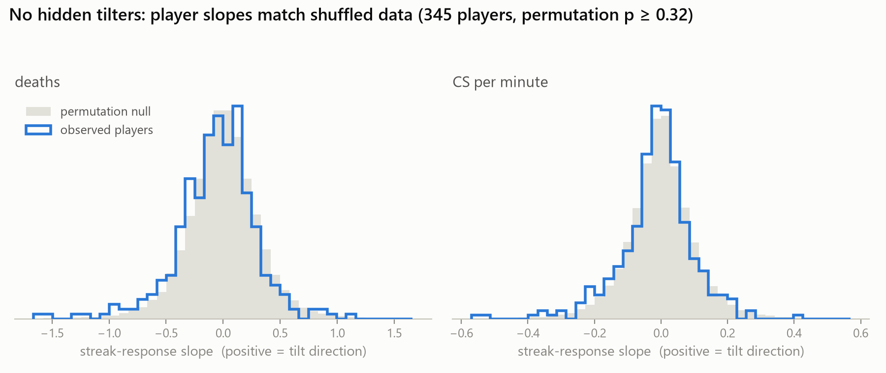
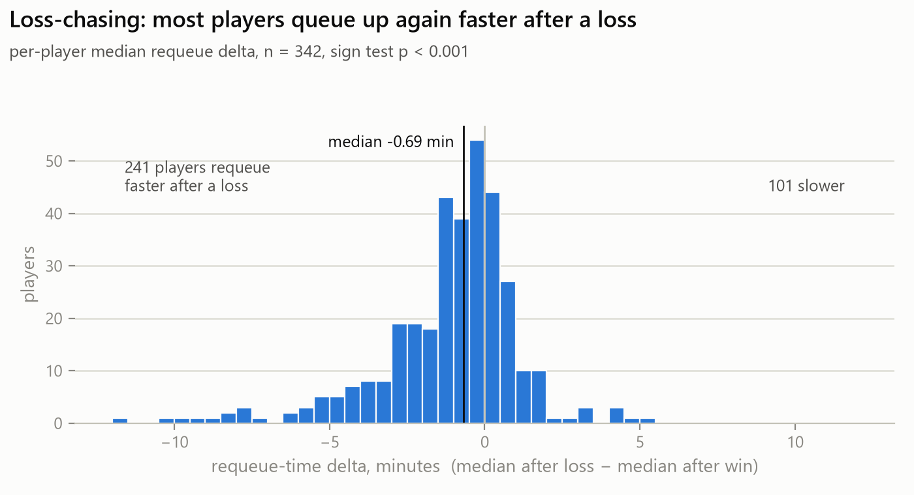

# The tilt spiral is a myth. Loss-chasing is real.

*Measuring 345 ranked League players against their own baselines — working title,
alternatives: "I went looking for tilt and found something else" / "Tilt doesn't
show up where everyone thinks it does"*

> **Status: skeleton.** Numbers are final (from `analyze.py` and `traits.py` on the
> current crawl). Prose marked `TODO` still needs writing. Figures not yet made.

## TL;DR

- Within a play session, a losing streak does **not** measurably degrade a
  player's own performance. Deaths, CS/min: flat against that player's own
  per-role baseline, across ~32k ranked games (population effect on deaths
  bounded below ~0.2 per game).
- It's not hiding in a subgroup either. Per-player streak-response slopes are
  statistically indistinguishable from shuffled data (permutation p = 0.32);
  14 players look like "tilters" where chance alone predicts 17.
- Next-game winrate after 3+ straight losses: **54%** — same as baseline.
  "Loser's queue" doesn't appear in this sample.
- What IS real: **loss-chasing.** 241 of 342 players requeue faster after a
  loss than after a win (median 0.69 min faster, p < 0.001), and players are
  less likely to end the session after a loss (40.6%) than after a win
  (44.8%, paired p = 0.006). People quit while ahead and chase when behind —
  but the chasing doesn't cost them games.

## 1. The question, and why win/loss can't answer it

- TODO: the folk model of the spiral (lose → play worse → lose more).
- The confound: matchmaking pushes everyone toward 50%, and any single game is
  4/5ths other people. "You lose more after losing" is compatible with the
  ranking system just working.
- The narrower, answerable question: does a player's *own* performance drift
  from their *own* baseline during a losing streak, inside a session?

## 2. Data

- Riot MATCH-V5 / LEAGUE-V4, read-only, published rate limits.
- Rank-stratified crawl seeded from the ranked ladders, Gold → Challenger,
  ~50–60 fully-crawled players per tier; 345 players with ≥ 20 ranked games,
  ~32k player-games total. TODO: exact region/patch window, crawl dates.
- Only fully-crawled seed players are analyzed — players who merely appear as
  opponents have gap-filled histories that would fabricate sessions.
- Filters: ranked solo (queue 420), remakes/early surrenders dropped (< 5 min).

## 3. Method

- Sessions: games ≤ 30 min apart. Signed streak entering each game (−2 = two
  straight losses, +2 = two straight wins, 0 = first of session).
- Baseline: per player **per role** average. Why signed streaks matter: if you
  only track losing streaks, post-win "hot" games contaminate the baseline.
- Outcome: per-game deviation from own baseline (deaths, CS/min, KDA, damage),
  aggregated by streak state.
- Trait test: per-player OLS slope of deviation on streak, each player
  compared against their own permutation null (200 shuffles); heterogeneity =
  observed spread of slopes vs spread under the null.
- Behavior test: requeue latency and session-quit probability after a loss vs
  after a win, paired within player. No performance stats involved, so no
  teammate confound. Final recorded game per player treated as censored.
- TODO: one paragraph on why permutation nulls rather than parametric SEs.

## 4. Result 1 — no performance tilt, at any level of aggregation

- Population table (deaths_dev, cs_min_dev by streak bucket L3+ … W3+): flat.
  TODO: paste table, figure 1 (deviation vs streak with error bars).
- By tier, Gold → Challenger: flat; if anything Gold–Emerald players die
  slightly *less* than baseline deep in losing streaks (caution, or
  survivorship — see §7). TODO: figure 2 (tier × streak heatmap).
- Winrate by streak state: 51–54% everywhere, including after 3+ losses.
- Per-player: sd of observed slopes 0.349 (deaths) vs 0.342 under the null,
  p = 0.32; tilt-significant players 14 observed vs 17.2 expected by chance.
  CS/min: same story.

  
- What the null rules out and what it doesn't: bounded average effect
  (< ~0.2 deaths/game), no detectable tilted minority *on these metrics*.

## 5. Result 2 — loss-chasing is real

- Requeue: per-player median gap after loss minus after win = −0.69 min;
  241 faster vs 101 slower (n = 342, sign test p < 0.001).

  
- Session ending: P(quit after loss) = 40.6% vs P(quit after win) = 44.8%;
  per-player paired diff p = 0.006. "One more game" after a loss is real.
- The pairing matters: every comparison is the same player against themselves.

## 6. Interpretation

- The felt experience of tilt is real — the *behaviors* everyone associates
  with it (instant requeue, refusing to stop) show up strongly. The
  performance collapse attributed to it does not.
- Loss-chasing is also, empirically, not punished: next-game winrate after a
  streak is baseline. The classic advice "stop playing, you'll throw" isn't
  supported here; the honest statement is "keep playing or stop — the data
  says your next game is a coin flip either way."
- TODO: connect to the gambling literature on loss-chasing (this is the same
  behavioral signature, in a system with fairer odds).

## 7. Caveats

- **Survivorship:** performance during deep streaks is conditional on choosing
  to keep playing. Players who tilt-quit immediately are in the quit-rate
  number, not the streak-performance number. The design can't rule out "the
  ones who would have tilted logged off."
- Coarse metrics: deaths and CS/min are end-of-game aggregates, partly shaped
  by teammates and game state. Early-game timeline metrics (CS@10, deaths
  before 14:00) would be a sharper test. Future work.
- One region, one patch window, ranked solo only; Gold and above (no
  Iron–Silver in the sample).
- Baseline includes streak games (attenuates large effects slightly; with
  effects this close to zero it doesn't change conclusions).
- Session gap of 30 min is a choice, so everything was rerun at 15 and 60 min.
  The performance null and the requeue effect hold at both (requeue delta
  −0.41 min at 15, −0.78 at 60, both p < 0.001). The quit-rate gap holds at
  15 min (p < 0.001) but attenuates at 60 (median per-player diff −0.027,
  p = 0.066) — unsurprising, since an hour-long break barely counts as
  "ending the session," but stated for completeness.

## 8. Reproduce it

- `crawl.py` (rate-limited, resumable, rank-stratified) → `tilt.db` →
  `analyze.py` (population) / `traits.py` (per-player + behavior, seeded) /
  `figures.py` (regenerates every figure from the db).
- TODO: exact commands, dataset row counts, runtime.
