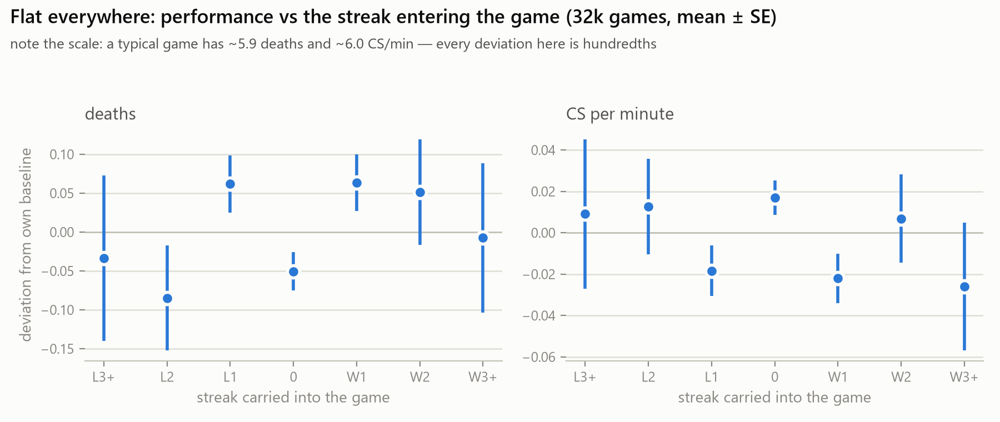
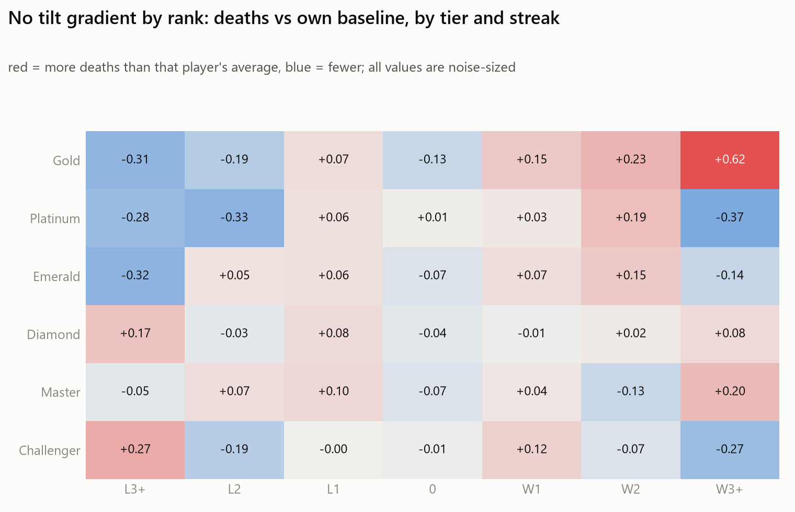

# The tilt spiral is a myth. Loss-chasing is real.

*Measuring 345 ranked League of Legends players against their own baselines.*

> **Status: draft.** Numbers and figures are final and regenerate from the
> database (`analyze.py`, `traits.py`, `figures.py`). Prose is ready for a
> read-through.

## TL;DR

- Within a play session, a losing streak does **not** measurably degrade a
  player's own performance. Deaths and CS/min stay flat against that player's
  own per-role baseline across ~32k ranked games; the population effect on
  deaths is bounded below ~0.2 deaths per game.
- It's not hiding in a subgroup either. Per-player streak-response slopes are
  statistically indistinguishable from shuffled data (permutation p = 0.32);
  14 players look like "tilters" where chance alone predicts 17.
- Next-game winrate after 3+ straight losses: **54%** — same as baseline.
  "Loser's queue" doesn't appear in this sample.
- What IS real: **loss-chasing.** 241 of 342 players requeue faster after a
  loss than after a win (median 0.69 minutes faster, p < 0.001), and players
  are less likely to end the session after a loss (40.6%) than after a win
  (44.8%, paired p = 0.006). People quit while ahead and chase when behind —
  but the chasing doesn't cost them games.

## 1. The question, and why win/loss can't answer it

Every ranked player knows the story: you lose a game, you queue up angry, you
play worse, you lose again. The spiral. The standard advice is built on it —
"stop after two losses," "you'll just throw the next one."

The problem is that win/loss can't tell you whether any of that is true.
Matchmaking pushes everyone toward a 50% winrate by design, and any single
game depends mostly on nine other people. "You lose more after losing" is
exactly what a fair ranking system produces on its own, no psychology
required. So the folk claim needs to be narrowed into something the data can
actually answer:

> Inside a play session, does a player's **own** performance — deaths, CS per
> minute — measurably drift from that **same player's** normal baseline during
> a losing streak, and by how much?

Comparing a player against their own baseline is the load-bearing choice. It
separates tilt (actually playing worse) from matchmaking (losing at your usual
level of play).

## 2. Data

Everything comes from the official Riot API (MATCH-V5, LEAGUE-V4, ACCOUNT-V1),
read-only, within published rate limits.

- **30,014 ranked solo/duo matches** (300,140 participant rows) from the NA
  server, crawled in early July 2026. Histories reach back further, but 75% of
  the games were played after March 2026.
- **Rank-stratified:** the crawler seeds players directly from the ranked
  ladders and grows every tier at the same pace — 50–60 fully-crawled players
  in each of Gold, Platinum, Emerald, Diamond, Master, and Challenger.
- **345 analyzed players** — only fully-crawled seeds with ≥ 20 ranked games.
  Players who merely appear as opponents have gap-filled histories that would
  fabricate sessions, so they're excluded.
- Filters: ranked solo (queue 420) only; remakes and sub-5-minute games
  dropped.

One sampling note: the baseline winrate in this sample is ~54%, not 50%,
because current ladder members skew toward players on the way up. Nothing
below compares against 50%; every comparison is within the sample.

## 3. Method

**Sessions and streaks.** A player's games are ordered by time and split into
sessions wherever there's a gap of more than 30 minutes. Each game is tagged
with the signed streak the player carried into it: −2 means two straight
losses just before this game, +2 means two straight wins, 0 means the first
game of a session. Wins and losses break each other's streaks.

**Baseline.** Per player *per role*: a mid-laner's CS numbers are not a
support's. A metric's deviation is that game's value minus the player's own
per-role average. Tracking win streaks alongside losing streaks matters —
if you only look at losing streaks, post-win "hot" games silently contaminate
the baseline you're measuring against.

**The trait test.** A flat population average could still hide a tilted
minority. So for each player, I fit the slope of deviation against streak
state, then compared it to that player's own permutation null: shuffle which
deviation goes with which streak, recompute the slope, 200 times. A real
tilter beats their null; a population with a tilted minority shows more
spread in observed slopes than the shuffled data produces. Permutation nulls
rather than parametric standard errors because per-player game counts are
small (20–100) and the deviations are nowhere near normal — the null is exact
for the question being asked, "could this slope arise with no streak-
performance link at all?"

**The behavior test.** Two measures that never touch performance stats, so
teammates can't confound them: (1) requeue time — within a session, how long
after a loss vs after a win does the same player start their next game; and
(2) session-ending — the probability that a game is the session's last, given
its result. Both are paired within player. Each player's final recorded game
is treated as censored (the crawl cut it off, not the player).

## 4. Result 1 — no performance tilt, at any level of aggregation

The population-level answer is flat:

| streak entering the game | games | deaths dev | CS/min dev | winrate |
|---|---|---|---|---|
| L3+ | 769 | −0.03 ± 0.11 | +0.01 ± 0.04 | 54% |
| L2 | 1,839 | −0.08 ± 0.07 | +0.01 ± 0.02 | 54% |
| L1 | 6,285 | +0.06 ± 0.04 | −0.02 ± 0.01 | 51% |
| 0 | 13,973 | −0.05 ± 0.02 | +0.02 ± 0.01 | 54% |
| W1 | 6,418 | +0.06 ± 0.04 | −0.02 ± 0.01 | 53% |
| W2 | 1,989 | +0.05 ± 0.07 | +0.01 ± 0.02 | 54% |
| W3+ | 937 | −0.01 ± 0.10 | −0.03 ± 0.03 | 54% |



No spiral shape — deaths don't climb and CS doesn't fall toward the L side.
And the winrate column is its own result: after three or more straight
losses, players win their next game at the sample's baseline rate. Whatever
"loser's queue" feels like, it isn't in the match outcomes.

The same flatness holds at every rank. If tilt were real anywhere, Gold
should show it more than Challenger; instead both are noise:



And it isn't hiding in a subgroup. The per-player slope distribution sits
exactly on its permutation null — spread 0.349 observed vs 0.342 shuffled for
deaths (p = 0.32), with 14 players beating their null in the tilt direction
where chance predicts 17. CS/min tells the same story:


What the null does and doesn't rule out: the *average* effect is bounded
below ~0.2 deaths per game (against a typical ~5.9), and there is no
detectable tilted minority *on these metrics*. Sharper metrics might yet find
something — see the caveats.

## 5. Result 2 — loss-chasing is real

The behavioral measures are not flat. Same players, same sessions:

- **Requeue time.** Per player, median requeue after a loss minus after a
  win: **−0.69 minutes**. 241 of 342 players requeue faster after a loss, 101
  slower (sign test p < 0.001).

  

- **Session-ending.** The chance a game is the session's last is **40.6%
  after a loss vs 44.8% after a win**; the per-player paired difference goes
  the same direction (p = 0.006). "One more game" after a loss is real, and
  so is quitting while ahead.

The pairing is what makes this clean: every comparison is a player against
their own behavior on the other outcome. No teammates, no matchmaking, no
performance stats involved.

## 6. What I make of it

The felt experience of tilt is real — the *behaviors* everyone associates
with it show up strongly and in the predicted direction. The performance
collapse attributed to it does not show up at all.

This pattern has a name in gambling research: **loss-chasing** — continuing
and escalating play to recover losses — is one of the most robust behavioral
markers of problem gambling ([Breen & Zuckerman 1999](https://www.sciencedirect.com/science/article/abs/pii/S0191886999000525);
[O'Connor & Dickerson 2003](https://link.springer.com/article/10.1023/A:1026375809186)),
and recent within-session studies of online casino play find the same
signature measured the same way this project measures it: shorter pauses and
longer persistence after losses ([Scientific Reports, 2024](https://www.nature.com/articles/s41598-024-70738-3)).
The interesting difference is the economics. In gambling, chasing is punished
— the odds are negative, so more play means more loss. In ranked League,
matchmaking keeps the next game fair no matter how tilted you feel: the
chasing happens, but the winrate data shows it isn't being punished. Same
psychology, different house.

Two honest wrinkles. First, the winrate dips slightly after exactly one loss
(51% vs 54%) and recovers by L2+ — small but larger than its standard error,
and unexplained here; flagged for future work. Second, in Gold through
Emerald, players deep in losing streaks die slightly *less* than their own
average. That could be caution, or it could be selection — the players still
queuing after three losses are the ones having a fine day (see below).

On the advice: the standard "stop playing, you'll just throw" isn't supported
by this data. The honest statement is descriptive — after a bad streak, your
next game is a coin flip at your usual level, so keep playing or stop for
your own reasons; the numbers don't make the call for you.

## 7. Caveats

- **Survivorship.** Performance during deep streaks is conditional on
  choosing to keep playing. Players who tilt-quit immediately show up in the
  quit-rate result, not the streak-performance result. This design cannot
  rule out "the ones who would have tilted logged off first."
- **Coarse metrics.** Deaths and CS/min are end-of-game aggregates, partly
  shaped by teammates and game state. Early-game timeline metrics (CS at 10
  minutes, deaths before 14:00) are more within-player-controllable and would
  be a sharper test. Future work.
- **One region, one window, Gold and above.** NA ranked solo, mostly
  March–July 2026, no Iron–Silver (and no Grandmaster seeds). Tilt among
  brand-new or low-rank players is untested here.
- **Baseline contamination.** The baseline includes streak games, which
  slightly attenuates any true effect. With effects this close to zero it
  doesn't change conclusions.
- **The 30-minute session gap is a choice**, so everything was rerun at 15
  and 60 minutes. The performance null and the requeue effect hold at both
  (requeue delta −0.41 min at 15, −0.78 at 60, both p < 0.001). The quit-rate
  gap holds at 15 (p < 0.001) but attenuates at 60 (median per-player diff
  −0.027, p = 0.066) — unsurprising, since an hour-long break barely counts
  as "ending the session," but stated for completeness.

## 8. Reproduce it

```bash
pip install -r requirements.txt
cp .env.example .env          # add your Riot API key
python crawl.py               # seeds the ladders, crawls toward 30k matches
python analyze.py             # population + per-tier report
python traits.py              # per-player slopes + behavior (seeded, exact repro)
python figures.py             # regenerates every figure from the db
```

The crawl is the long pole: at the dev-key rate cap (0.8 req/s) 30k matches
takes a few days; it's resumable, all state lives in the SQLite file. The
analysis itself runs in minutes: 30,014 matches → 350 crawled seeds → 345
analyzed players. `SESSION_GAP_MIN=15 python traits.py` reproduces the
robustness runs.
